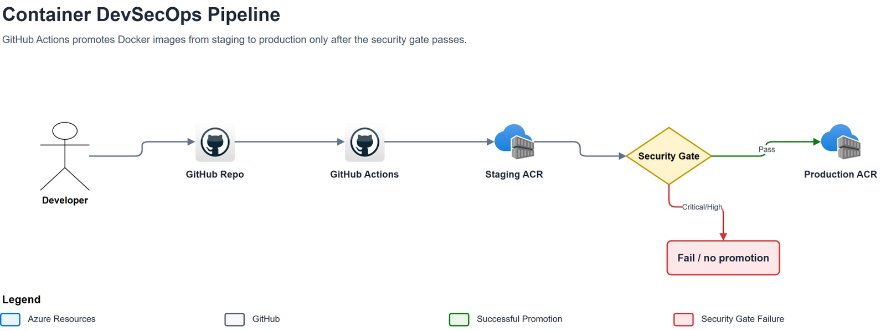
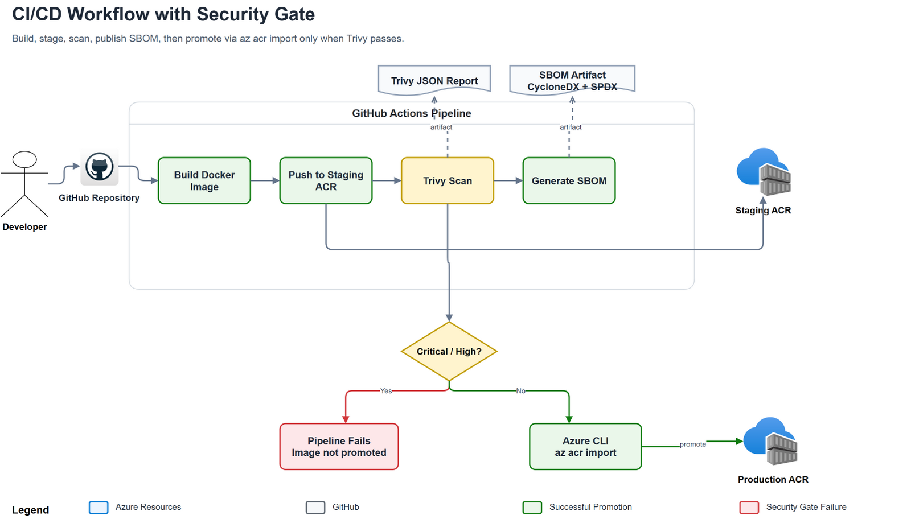
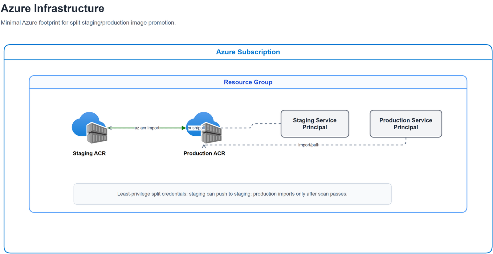

# Container Image Scanning and Promotion Pipeline

Builds a demo Flask container, pushes it to staging Azure Container Registry, scans it with Trivy, generates SBOM artifacts, and promotes only clean images to production ACR.

This project demonstrates a practical DevSecOps supply-chain gate: the image that reaches production is the exact digest that passed vulnerability scanning.

## Video walkthrough

[](https://www.loom.com/share/dbb300d63e9b4a94bfe4eb1c36625405)

Watch the project walkthrough on Loom: [Making Container Image Scans Production Mandatory](https://www.loom.com/share/dbb300d63e9b4a94bfe4eb1c36625405).

## What this demonstrates

- Terraform-provisioned Azure infrastructure
- Separate staging and production Azure Container Registries
- Scoped service principals instead of ACR admin users
- GitHub Actions CI/CD with a security gate
- Trivy vulnerability scanning
- CycloneDX and SPDX SBOM generation
- Digest-based image promotion with `az acr import`
- Cost-aware teardown workflow

## High-level architecture

The pipeline separates build, staging, scan, and production promotion. Failed scans stop before production.



Editable source: [`assets/diagrams/high-level-architecture.drawio`](assets/diagrams/high-level-architecture.drawio)

## CI/CD workflow

GitHub Actions builds the image, pushes it to staging ACR, scans the immutable image digest with Trivy, uploads security artifacts, and promotes only after scan and SBOM jobs pass.



Editable source: [`assets/diagrams/ci-cd-workflow.drawio`](assets/diagrams/ci-cd-workflow.drawio)

## Azure infrastructure

Terraform creates a small, low-cost Azure footprint: one resource group, two Basic ACR instances, two service principals, and scoped ACR role assignments.



Editable source: [`assets/diagrams/azure-infrastructure.drawio`](assets/diagrams/azure-infrastructure.drawio)

## Repository layout

- `infra/` — Terraform for resource group, staging/prod ACRs, service principals, and role assignments.
- `app/` — demo Flask app used by the pipeline.
- `Dockerfile` — non-root Python image.
- `.github/workflows/container-pipeline.yml` — build, scan, SBOM, and promote workflow.
- `.trivyignore` — documented accepted-risk suppressions.
- `docs/project-plan.md` — detailed project outline and implementation reference.
- `assets/diagrams/` — editable draw.io diagrams and README PNG exports.

## Lab cost guardrails

- Infra is isolated in one resource group: `rg-container-pipeline-<yourname>`.
- ACR uses `Basic`; no AKS, VM, database, or always-on compute is created.
- Current East US retail meter for Basic ACR is about `$0.1666/day` per registry; this lab creates two, so roughly `$0.33/day` before network/extra storage.
- Resources get `lab=true` and `expires_on=<date>` tags.
- Optional Azure budget alerts are created when `budget_email` is set in `infra/terraform.tfvars`.
- Azure budgets alert only; they do not cap billing. The real cutoff is `terraform destroy`.

Before applying, set:

```hcl
expires_on            = "2026-07-01"
budget_email          = "you@example.com"
monthly_budget_amount = 5
budget_start_date     = "2026-06-01T00:00:00Z"
```

## Setup

```bash
az login
az account set --subscription "<subscription name or id>"
cp infra/terraform.tfvars.example infra/terraform.tfvars
# edit infra/terraform.tfvars; yourname must be globally unique for ACR names
cd infra
terraform init
terraform plan
terraform apply
```

Add these GitHub Actions secrets from `terraform output -raw <name>`:

| Secret | Terraform output |
|---|---|
| `STAGING_ACR_NAME` | `staging_acr_name` |
| `PROD_ACR_NAME` | `prod_acr_name` |
| `STAGING_CLIENT_ID` | `staging_client_id` |
| `STAGING_CLIENT_SECRET` | `staging_client_secret` |
| `PROD_CLIENT_ID` | `prod_client_id` |
| `PROD_CLIENT_SECRET` | `prod_client_secret` |
| `AZURE_TENANT_ID` | `tenant_id` |
| `AZURE_SUBSCRIPTION_ID` | `subscription_id` |

Push to `main` or run the workflow manually from GitHub Actions.

## Verification

The promotion step imports the scanned image by digest, then tags that exact image as both `${{ github.sha }}` and `latest` in production.

Verify registry tags after a successful workflow:

```bash
./scripts/verify-registries.sh
```

Expected result:

- Staging ACR contains `demo-app:<sha>` and `demo-app:staging-latest`.
- Production ACR contains `demo-app:<sha>` and `demo-app:latest`.
- GitHub Actions contains the Trivy JSON report artifact.
- GitHub Actions contains CycloneDX and SPDX SBOM artifacts.

## Teardown

Only tear down after collecting screenshots/evidence.

```bash
./scripts/destroy-lab.sh
```

Confirm nothing remains:

```bash
az group exists --name "rg-container-pipeline-<yourname>"
```

That command should return `false`.
