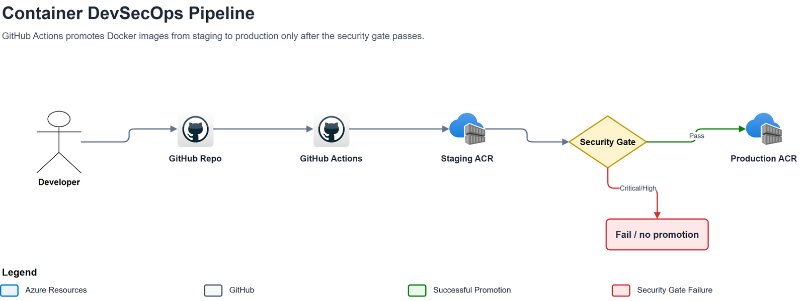
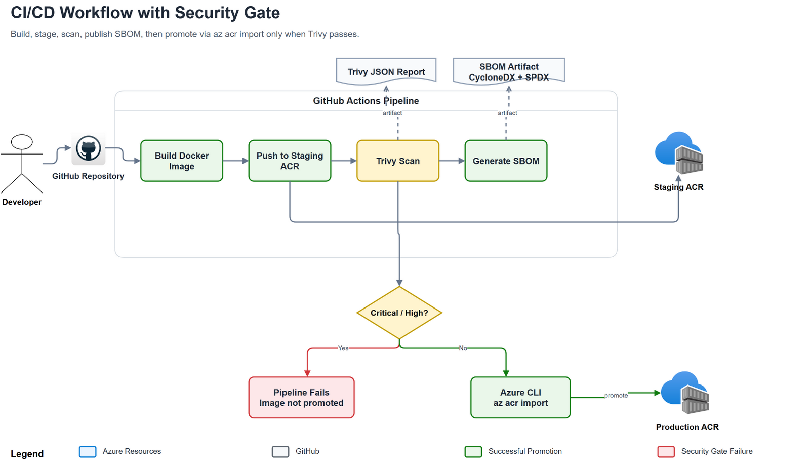
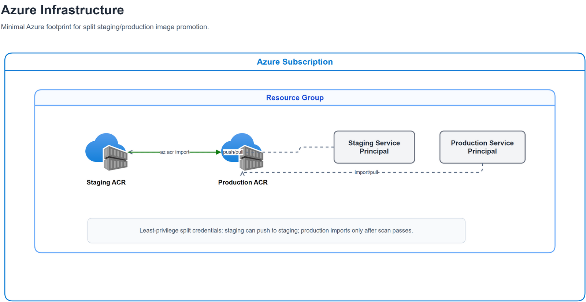

# Container Image Scanning and Promotion Pipeline

Builds a demo Flask container, pushes it to staging Azure Container Registry, scans it with Trivy, uploads SBOMs, then promotes only clean images to production ACR.

## Architecture







## Files

- `infra/` — Terraform for resource group, staging/prod ACRs, service principals, and role assignments.
- `app/` — demo Flask app used by the pipeline.
- `Dockerfile` — non-root Python image.
- `.github/workflows/container-pipeline.yml` — build, scan, SBOM, and promote workflow.
- `.trivyignore` — documented accepted-risk suppressions.

## Lab cost guardrails

- Infra is isolated in one resource group: `rg-container-pipeline-<yourname>`.
- ACR uses `Basic`; no AKS, VM, database, or always-on compute is created.
- Current East US retail meter for Basic ACR is about `$0.1666/day` per registry; this lab creates two, so roughly `$0.33/day` before network/extra storage.
- Resources get `lab=true` and `expires_on=<date>` tags.
- Optional Azure budget alerts are created when `budget_email` is set in `infra/terraform.tfvars`.
- Azure budgets alert only; they do not cap billing. The real cutoff is `terraform destroy`.

Before applying, set:

```hcl
expires_on            = "2026-07-01"
budget_email          = "you@example.com"
monthly_budget_amount = 5
budget_start_date     = "2026-06-01T00:00:00Z"
```

When screenshots/evidence are done and you are ready to tear down:

```bash
./scripts/destroy-lab.sh
```

Confirm nothing remains:

```bash
az group exists --name "rg-container-pipeline-<yourname>"
```

That command should return `false`.

## Setup

```bash
az login
az account set --subscription "<subscription name or id>"
cp infra/terraform.tfvars.example infra/terraform.tfvars
# edit infra/terraform.tfvars; yourname must be globally unique for ACR names
cd infra
terraform init
terraform apply
```

Add these GitHub Actions secrets from `terraform output -raw <name>`:

- `STAGING_ACR_NAME`
- `PROD_ACR_NAME`
- `STAGING_CLIENT_ID`
- `STAGING_CLIENT_SECRET`
- `PROD_CLIENT_ID`
- `PROD_CLIENT_SECRET`
- `AZURE_TENANT_ID`
- `AZURE_SUBSCRIPTION_ID`

Push to `main` to run the pipeline.

The promotion step imports the scanned image by digest, then tags that exact image as both `${{ github.sha }}` and `latest` in production.

Verify registry tags after a successful workflow:

```bash
./scripts/verify-registries.sh
```

## Teardown

```bash
./scripts/destroy-lab.sh
```
